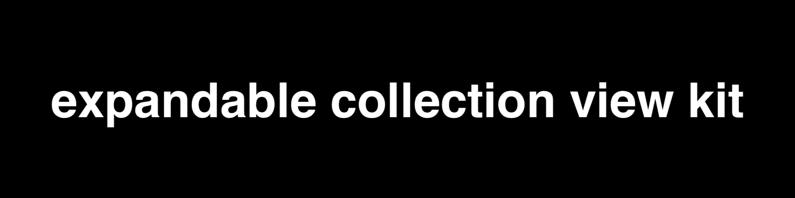

# expandable-collection-view-kit [](https://github.com/sindresorhus/awesome)

[]()
[]()
[]()
[]()
[]()

**Last Update: 19/October/2019.**



### If you like the project, please give it a star ⭐ It will show the creator your appreciation and help others to discover the repo.

# ✍️ About
🗂 Expandable, hierarchical, flexible, declarative UICollectionView with diffable data sources & SwiftUI-like tree items builder [Swift 5.1, iOS & iPadOS 13].

# 📺 Demo
Please wait while the `.gif` files are loading...

<p float="center">

 

 


</p>

<p float="center">

</p>

# 🍱 Features
- **Ease of use**
    - Instantiate `ExpandableCollectionViewManager` class, provide its parent view controller and specify the `Folders` and `Items`.
- **Flexible API**
    - There are many customization points that can be used to adjust: `Folders`, `Items`, `Navigation`, `appeareances` and also custom `animations`.
    - Swift's `Function Builders` make it very easy to create a tree of interconnected items 
- **Autolayout**
    - You don't need to do anything related to autolayout - the component properly handles all the changes. The only thing you need to do is to instantiate the `ExpandableCollectionViewManager` and fill it in with items.
- **Performant**
    - The under-the-hood implementation uses Swift's `Diffable Data Sources` and `Collection View Compositional Layout` which provides high performance and tested backing APi.
- **Extendable**
    - The component can be further extended with new types of items, `Function Builder` types (such as `For Each` that applies a group of modifiers to a set of items, rather than copy-pasting the same modifiers or managing boilerplate configuration), decoratable content views for items and the list goes on. 
  

# 📚 Usage

## Instantiation

### Basic
Create a property that will hold the  `ExpandableCollectionViewManager` reference and the instantiate it via one of the designated initializers:

```swift
let expVCManager = ExpandableCollectionViewManager(parentViewController: self)
```
Here `self` is the reference to the `UIViewController`  where the property is used. 

### Pre-filling
To pre-fill the collection view, you may use the trailing closure syntax for one of the designated initializers:

```swift
let expVCManager = ExpandableCollectionViewManager(parentViewController: self) {
    Folder(title: "ToDo") {
        Item(title: "Compose Email")
            .setImage(systemName: "paperplane")
        Item(title: "Watch Netflix")
    }

    Item(title: "Buy new iPhone")
    Item(title: "Cleanup")
}
```

## Configuration

### Adding More Items
You can add more items by using `appendItems` method:

```swift
expVCManager.appendItems {
    Folder(title: "Marvel") {
        Item(title: "Spider-Man")
        Item(title: "Iron Man")
        Item(title: "Black Widow")
    }
    Folder(title: "DC") {
        Item(title: "Batman")
        Item(title: "Batgirl")
        Item(title: "Nightwing")
    }
}
```

## Item Modifiers

There are a number of item modifiers that can be applied to them to change their behaviour or appearance:

```swift
expVCManager.appendItems {
    Folder(title: "Marvel") {
        Item(title: "Spider-Man")
            .setImage(systemName: "tray.full.fill") // 1
            
        Item(title: "Iron Man")
        Item(title: "Black Widow")
    }
    .setTintColor(.systemOrange) // 2
    .isExpanded(true) // 3
    .isItemsCountVisible(true) // 4

    Folder(title: "DC") {
        Item(title: "Batman")
        Item(title: "Batgirl")
        Item(title: "Nightwing")
    }
    .isChevronVisible(false) // 5
}
```

Let's break down the API's line by line:

1. Changes the default **image icon** for either `Item` and/or `Folder`
2. Changes **tint color** of a `Folder`'s icon
3. Determines whether a `Folder` is automatically **expanded** 
4. Displays a `Folder`'s **item counter** label that 
5. Changes the visibility of **chevron icon**

### Actions
`Actions` allow to specify a closure that will be executed on item tap action:

```swift
Item(title: "Spider-Man")
    .setImage(systemName: "spider.fill")
    .setAction { [weak self] indexPath, title in
        self?.showWarning("Item \(title) that is at \(indexPath) index path has been tapped.")
    }
```
Actions have two input parameters an item's `index path` and `title`. That should make the API more or less flexible for action handling use cases.

## Animator
You can specify cells' **unfold** animation. It's expressed as enum type, where the default is `.simple`, which is the `default diffing animation` (hide/show). However, there is a an another option that you to use one of the pre-built animations or implement and inject your own. 

```swift
expVCManager.unfoldAnimation = .custom(AnimationFactory.moveDown(duration: 0.415)) // 1
expVCManager.unfoldAnimation = .custom(AnimationFactory.verticalUnfold(duration: 0.435)) // 2
```
Let's break the sample code down. The `AnimationFactory` is a built-in type that has a number of pre-implemented animations. 

1. The `moveDown` animation simply moves each unfolded item to the direction of unfolding with the specified duration. 
2. The `verticalUnfold` animation is a bit more complicated: it applies a series of affine transformations to each unfolded cell. 

To define an inject your own animations, you need to use the following `typealias` that defines the required closure's signature for the `.custom` unfold animation type:

```swift
let delayFactor = 0.015

let slideOutAnimation: ExpandableItem.Animation = { cell, indexPath, collectionView, completion in
    UIView.animate(
        withDuration: duration,
        delay: delayFactor * Double(indexPath.row),
        options: [.curveEaseInOut],
        animations: {
         cell.transform = CGAffineTransform(translationX: collectionView.bounds.width, y: 0)
         
    }, completion: completion)
}

expVCManager.unfoldAnimation = .custom(slideOutAnimation)
```
Here we used the `ExpandalbeItem.Animation` typealias to get the right closure’s signature and then we implemented our custom cell animation. The final step is that we injected it via the `.custom(slideOutAnimation)` type.  

## Transition Handling
The component also supports custom handler for view controller transitioning. It can be specified via the following property:

```swift
expVCManager.onCellTapHandler = { _, destinationViewController in
    // 1. Prepare presentation part of the destination view controller
    let navController = UINavigationController(rootViewController: destinationViewController)
    // 2. Present the view controller
    self.present(navController, animated: true)
}
```
That makes different kinds of view controller navigation logic to work on a per-item basis. Which means for one view controller bound item we can use `UINavigationController` to present its view controller, wheres for some other  item we can use modal view controller presentation style.    

## View Controller Configuration
There is yet an another modifier for `Item` type that allows to specify a `UIViewController` type:

```swift
Item(title: "Spider-Man")
    .setImage(systemName: "spider.fill")
    .setViewControllerType(IssuesViewController.self) { [weak self] viewController in
    viewController.comics = self?.endpoint(\.latest.spiderman.comics)
    }
```
Here we specified the target view controller type that needs to be transitioned when the `Spider-Man` cell is tapped and its configuration code, where we, for example can inject data, perform any other operation or simply omit. 

# 🏗 Installation

## Swift Package Manager

To install the component, in `Xcode` select `File` ➡ `Swift Packages` ➡ `Add Package Dependency`. Then insert the following `URL` to locate the repository:

`https://github.com/jVirus/expandable-collection-view-kit`

After specifying which version do you want to install, the package will be downloaded and attached to your project. 

## Manual 
You can always use copy-paste the sources method 😄. Or you can compile the framework and include it with your project.


# 🙋‍♀️🙋‍♂️ Contributing
Your contributions are always appreciated. There are many ways how you help with the project:

- You can suggest something
- You can write additional documentation or sample codes
- Implement a new feature 
- Fix a bug
- Help to maintain by answering to the questions (if any) that other folks have
- etc.

Overall guidelies are:

- Please, discuss a feature or a major source change/addition before spending time and creating a pool requested via issues. 
- Create a separate branch and make sure that your code compiles and does not produce errors and warnings.
- Please, don't be upset if it takes a while to review your code or receive an answer.


# 👨‍💻 Author 
[Astemir Eleev](https://github.com/jVirus)

# 🔖 Licence 
The project is available under [MIT Licence](https://github.com/jVirus/expandable-collection-view-kit/blob/master/LICENSE)
